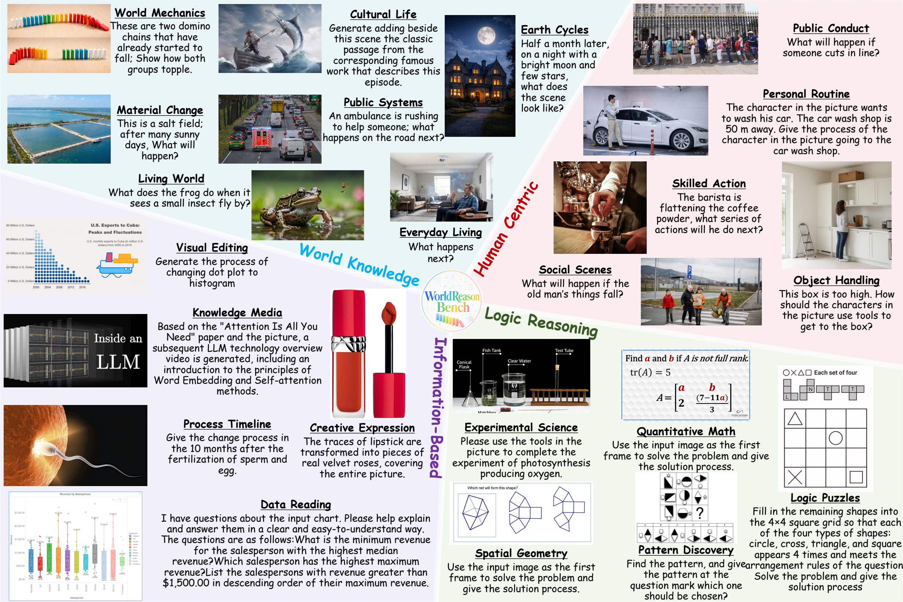
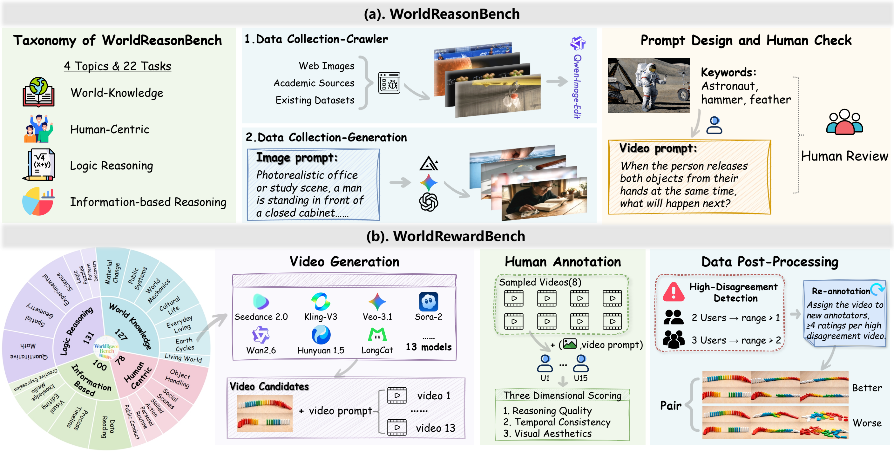
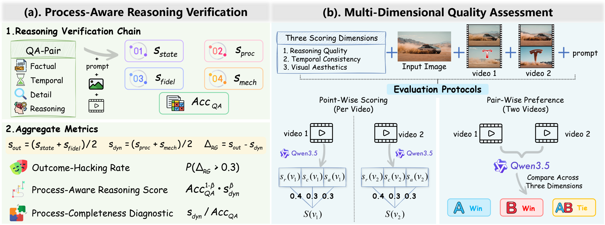
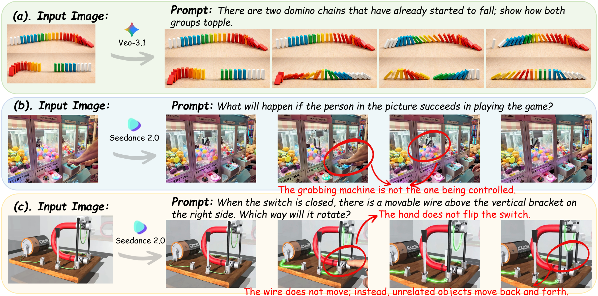
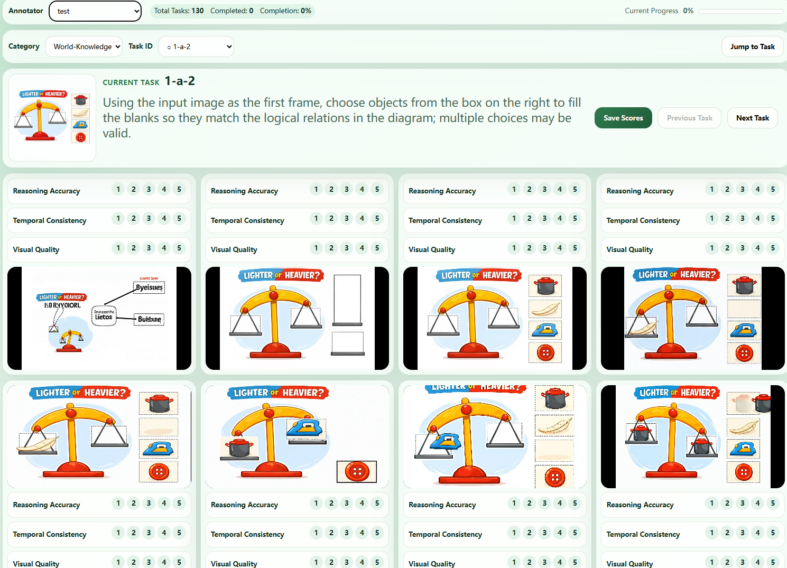

# WorldReasonBench: Human-Aligned Stress Testing of Video Generators as Future World-State Predictors

> Can a video generator **reason** about how the world should evolve — not just **render** it?

<p align="center">
  <b>436 cases &nbsp;·&nbsp; 4 reasoning dimensions &nbsp;·&nbsp; 22 subcategories &nbsp;·&nbsp; 13 generators &nbsp;·&nbsp; ~6K expert preference pairs</b>
</p>

<div align="center">

[](https://arxiv.org/abs/2605.10434)
[](https://unix-ai-lab.github.io/WorldReasonBench/)
[](https://github.com/UniX-AI-Lab/WorldReasonBench)
[](https://huggingface.co/datasets/WorldReasonBench)
[](https://huggingface.co/papers/2605.10434)

</div>

<p align="center">
  
</p>

---

## Abstract

Commercial video generation systems such as **Seedance2.0** and **Veo3.1** have rapidly improved,
strengthening the view that video generators may be evolving into "world simulators". Yet the
community still lacks a benchmark that directly tests whether a model can reason about how an
observed world should evolve over time.

We introduce **WorldReasonBench**, which reframes video generation evaluation as
*world-state prediction*: given an initial state and an action, can a model generate a future
video whose state evolution remains physically, socially, logically, and informationally
consistent? It contains **436 curated test cases** with structured ground-truth QA annotations
spanning four reasoning dimensions and 22 subcategories.

We further release **WorldRewardBench**, a preference benchmark with approximately
**6K expert-annotated pairs** over 1.4K videos, supporting pair-wise and point-wise
reward-model evaluation.

---

## Key Numbers

| 436 | 22 | 11 | 6,000+ | 15 | 0.955 |
|:---:|:---:|:---:|:---:|:---:|:---:|
| Test Cases | Subcategories | Generators | Preference Pairs | Annotators | Score<sub>PR</sub> – Human ρ |

---

## Method — Construction & Evaluation Pipelines

A three-stage VLM-assisted construction pipeline produces structured ground-truth QA pairs,
and a two-part evaluation methodology turns generated videos into human-aligned scores.

<table>
<tr>
<td width="50%" align="center">
<b>Construction</b><br/>
<br/>
<sub><b>WorldReasonBench &amp; WorldRewardBench construction.</b> Taxonomy-aware captioning → reasoning-aware prompt generation → structured QA generation, with expert scoring and preference-pair construction for the reward bench.</sub>
</td>
<td width="50%" align="center">
<b>Evaluation</b><br/>
<br/>
<sub><b>Two complementary components.</b> <i>Process-aware Reasoning Verification</i> turns structured QA into reasoning-phase diagnostics; <i>Multi-dimensional Quality Assessment</i> scores each video on reasoning quality, temporal consistency, and visual aesthetics.</sub>
</td>
</tr>
</table>

### Scoring formulas

<table>
<tr>
<td width="50%" align="center">

**Score<sub>PR</sub> = Acc<sub>QA</sub><sup>0.8</sup> · s<sub>dyn</sub><sup>0.2</sup>**

<sub>Process-aware reasoning score — outcome-completeness penalised on dynamic-phase failures.</sub>

</td>
<td width="50%" align="center">

**S(v) = 0.4 · s<sub>r</sub> + 0.3 · s<sub>c</sub> + 0.3 · s<sub>a</sub>**

<sub>Multi-dimensional quality score — reasoning, temporal consistency, visual aesthetics.</sub>

</td>
</tr>
</table>

---

## Leaderboard — Main Results

All 11 generators evaluated on a shared evaluation set for fully controlled cross-model comparison.
Higher is better. Closed-source models are listed above the divider, open-source models below.

### Score<sub>PR</sub> (Process-aware Reasoning, %)

| # | Model | Family | Overall | World Knowledge | Human-Centric | Logic Reasoning | Information-Based |
|---|-------|--------|--------:|----------------:|--------------:|----------------:|------------------:|
| 1 | **Seedance2.0** | Closed | **39.8** | 43.2 | 35.9 | **31.7** | **47.6** |
| 2 | Veo3.1-Fast    | Closed | 35.3 | **55.0** | 35.1 | 25.7 | 28.6 |
| 3 | Sora2          | Closed | 34.3 | 36.9 | **44.7** | 25.9 | 37.3 |
| 4 | Kling          | Closed | 32.7 | 42.2 | 32.5 | 22.4 | 35.7 |
| 5 | Wan2.6         | Closed | 32.4 | 35.2 | 34.5 | 26.2 | 35.5 |
| — | — | — | — | — | — | — | — |
| 6 | HunyuanVideo-1.5  | Open | 17.9 | 21.6 | 8.1 | 12.7 | 24.2 |
| 7 | Wan2.2-14B        | Open | 17.5 | 22.9 | 14.5 | 16.4 | 15.0 |
| 8 | LongCat-Video     | Open | 17.4 | 13.3 | 22.8 | 12.6 | 22.8 |
| 9 | Cosmos-Predict2.5 | Open | 16.9 | 15.2 | 22.2 | 7.1  | 24.7 |
|10 | LTX2.3            | Open | 16.8 | 15.6 | 19.3 | 11.9 | 22.7 |
|11 | UniVideo          | Open | 14.4 | 13.8 | 15.8 | 11.2 | 17.3 |

### S(v) (Multi-dimensional Quality, %)

| # | Model | Family | Overall | World Knowledge | Human-Centric | Logic Reasoning | Information-Based |
|---|-------|--------|--------:|----------------:|--------------:|----------------:|------------------:|
| 1 | **Seedance2.0** | Closed | **59.4** | 70.4 | 83.9 | **56.7** | 42.5 |
| 2 | Sora2          | Closed | 56.9 | 62.6 | 76.7 | 43.0 | **58.0** |
| 3 | Kling          | Closed | 55.4 | 72.0 | **87.2** | 37.3 | 48.8 |
| 4 | Veo3.1-Fast    | Closed | 54.8 | **80.1** | 77.2 | 31.5 | 47.2 |
| 5 | Wan2.6         | Closed | 50.3 | 61.8 | 64.2 | 42.3 | 42.6 |
| — | — | — | — | — | — | — | — |
| 6 | Cosmos-Predict2.5 | Open | 30.5 | 40.8 | 30.8 | 26.7 | 26.1 |
| 7 | Wan2.2-14B        | Open | 30.0 | 39.4 | 38.1 | 19.5 | 30.5 |
| 8 | LTX2.3            | Open | 28.1 | 35.1 | 27.8 | 24.7 | 25.8 |
| 9 | HunyuanVideo-1.5  | Open | 27.0 | 37.7 | 35.3 | 19.8 | 22.5 |
|10 | LongCat-Video     | Open | 25.3 | 35.1 | 42.8 | 16.3 | 20.2 |
|11 | UniVideo          | Open | 21.3 | 29.4 | 37.2 | 14.4 | 16.0 |

---

## Validation — Metrics Align with Human Ranking

Pairwise expert evaluation gives each model a Human Elo. Our automated **Score<sub>PR</sub>**
reproduces the human ranking with absolute rank displacement |Δr| ≤ 1 on 8 of 11 models, while
a generic Qwen3.5-Thinking judge drifts by up to four positions.

| # | Model | Human Elo | Judge Elo | Judge Rank | Acc<sub>QA</sub> (%) | \|Δr\| | Score<sub>PR</sub> (%) | \|Δr\| | s<sub>dyn</sub>/Acc<sub>QA</sub> |
|---|-------|----------:|----------:|-----------:|---------------------:|-------:|-----------------------:|-------:|---------------------------------:|
| 1 | Seedance2.0       | **1471** | 1183 | 3 | **41.2** | 0 | **39.8** | 0 | 0.84 |
| 2 | Veo3.1-Fast       | 1253     | 1151 | 4 | 36.0 | 0 | 35.3 | 0 | 0.91 |
| 3 | Kling             | 1240     | 1142 | 5 | 34.0 | 2 | 32.7 | 1 | 0.82 |
| 4 | Wan2.6            | 1211     | 1130 | 6 | 34.7 | 0 | 32.4 | 1 | 0.71 |
| 5 | Sora2-8s          | 1118     | **1222** | 1 | 35.3 | 2 | 34.3 | 2 | 0.86 |
| 6 | Sora2-12s         | 1109     | 1217 | 2 | 33.5 | 0 | 32.4 | 0 | 0.84 |
| — | — | — | — | — | — | — | — | — | — |
| 7 | Wan2.2-14B        | 953 | 913 | 7  | 19.6 | 2 | 17.5 | 1 | 0.57 |
| 8 | HunyuanVideo-1.5  | 911 | 841 | 9  | 20.2 | 1 | 17.9 | 1 | 0.56 |
| 9 | LongCat-Video     | 904 | 876 | 8  | 19.7 | 1 | 17.4 | 0 | 0.54 |
|10 | UniVideo          | 665 | 737 | 11 | 16.2 | 1 | 14.4 | 1 | 0.56 |
|11 | LTX2.3            | 587 | 802 | 10 | 18.5 | 1 | 16.8 | 1 | 0.63 |

---

## Qualitative — Generated Videos Across the Reasoning Taxonomy

Visually plausible generations can still fail process-level world reasoning. Representative
examples from each reasoning dimension:

> **How videos display:** GitHub renders inline `<video>` tags only when the `src` points to a GitHub-hosted asset URL (e.g. an attachment URL like `https://github.com/<org>/<repo>/assets/...`). The tags below use **relative paths** to the MP4s under `assets/videos/`, so they will play inline when this README is rendered locally (e.g. in VS Code, Cursor, Obsidian, the project website) and degrade to a download link on GitHub. To get inline playback on the GitHub repo page, drag-and-drop each MP4 into a GitHub issue/PR comment, then replace `src=...` with the resulting attachment URL.

### World Knowledge

| Domino chains — *Seedance 2.0* | Pencil in water — *Seedance 2.0* | Releasing two objects — *Wan 2.6* |
|:---:|:---:|:---:|
| <video src="assets/videos/WorldKnowledge/wk_1.mp4" controls width="320"></video> | <video src="assets/videos/WorldKnowledge/wk_2.mp4" controls width="320"></video> | <video src="assets/videos/WorldKnowledge/wk_3.mp4" controls width="320"></video> |
| [`wk_1.mp4`](assets/videos/WorldKnowledge/wk_1.mp4)<br/><sub>*"These are two domino chains that have already started to fall; show how both groups topple."*</sub> | [`wk_2.mp4`](assets/videos/WorldKnowledge/wk_2.mp4)<br/><sub>*"The pencil is placed in water; what happens?"*</sub> | [`wk_3.mp4`](assets/videos/WorldKnowledge/wk_3.mp4)<br/><sub>*"When the person releases both objects in their hands at the same time, what will happen next?"*</sub> |

### Human-Centric

| Moving hands — *Kling V3* | Going to a car wash — *Seedance 2.0* | Reaching a high box — *Kling V3* |
|:---:|:---:|:---:|
| <video src="assets/videos/HumanCentric/hc_1.mp4" controls width="320"></video> | <video src="assets/videos/HumanCentric/hc_2.mp4" controls width="320"></video> | <video src="assets/videos/HumanCentric/hc_3.mp4" controls width="320"></video> |
| [`hc_1.mp4`](assets/videos/HumanCentric/hc_1.mp4)<br/><sub>*"What happens when this man moves his hands?"*</sub> | [`hc_2.mp4`](assets/videos/HumanCentric/hc_2.mp4)<br/><sub>*"The character in the picture wants to wash his car… going to the car wash shop."*</sub> | [`hc_3.mp4`](assets/videos/HumanCentric/hc_3.mp4)<br/><sub>*"This box is too high. How should the characters in the picture use tools to get to the box?"*</sub> |

### Logic Reasoning

| 2D → 3D methane — *Kling V3* | Solving a math problem — *Seedance 2.0* | Flame reaction experiment — *Wan 2.6* |
|:---:|:---:|:---:|
| <video src="assets/videos/LogicReasoning/lr_1.mp4" controls width="320"></video> | <video src="assets/videos/LogicReasoning/lr_2.mp4" controls width="320"></video> | <video src="assets/videos/LogicReasoning/lr_3.mp4" controls width="320"></video> |
| [`lr_1.mp4`](assets/videos/LogicReasoning/lr_1.mp4)<br/><sub>*"Transform 2D atomic / structural diagrams of methane into a clear 3D geometric model."*</sub> | [`lr_2.mp4`](assets/videos/LogicReasoning/lr_2.mp4)<br/><sub>*"Use the input image as the first frame to solve the problem and give the solution process."*</sub> | [`lr_3.mp4`](assets/videos/LogicReasoning/lr_3.mp4)<br/><sub>*"The picture shows the flame reaction of various metals — show the subsequent process of this experiment."*</sub> |

### Information-Based

| *The Little Prince* — *Veo 3.1* | Embryonic development — *Sora 2.0* | Tesla logo from dust — *Seedance 2.0* |
|:---:|:---:|:---:|
| <video src="assets/videos/InformationBased/ib_1.mp4" controls width="320"></video> | <video src="assets/videos/InformationBased/ib_2.mp4" controls width="320"></video> | <video src="assets/videos/InformationBased/ib_3.mp4" controls width="320"></video> |
| [`ib_1.mp4`](assets/videos/InformationBased/ib_1.mp4)<br/><sub>*Visualise a passage from "The Little Prince", one sentence per segment with subtitles.*</sub> | [`ib_2.mp4`](assets/videos/InformationBased/ib_2.mp4)<br/><sub>*"Give the change process in the 10 months after fertilization of sperm and egg."*</sub> | [`ib_3.mp4`](assets/videos/InformationBased/ib_3.mp4)<br/><sub>*"The red dust kicked up by the tires condenses into the Tesla brand T logo in the air."*</sub> |

### Qualitative comparison across models

<p align="center">
  
</p>

<p align="center"><sub><b>Qualitative comparison on representative reasoning cases.</b> Higher-scoring models better preserve the intended state transition and temporal dynamics.</sub></p>

---

## Human Study — Expert Annotation for WorldRewardBench

Fifteen trained annotators rate each video on **reasoning quality**, **temporal consistency**,
and **visual aesthetics**. Ratings are aggregated into per-video scores and pairwise preferences
for reward-model calibration.

<p align="center">
  
</p>

<p align="center"><sub>Annotation interface: input image, prompt, eight anonymised generations, and a 1–5 rubric over three dimensions.</sub></p>

---

## Reward-Model Alignment on WorldRewardBench

- **Pair-wise:** agreement (%) *w/ Ties* / *w/o Ties*.
- **Point-wise:** induced pairwise accuracy / Spearman ρ.

Open Qwen3.5-Thinking matches GPT-5.4 on three of four reasoning dimensions.

| Dimension | Protocol | GPT-5.4 (closed) | Gemini-3.1-Flash (closed) | Qwen3.5-9B Thinking (open) | Qwen3.5-27B Instruct (open) | Qwen3.5-27B Thinking (open) | Qwen3.5-27B Thinking · 4 FPS (open) |
|-----------|----------|:----------------:|:------------------------:|:--------------------------:|:--------------------------:|:--------------------------:|:----------------------------------:|
| *Frames used* |                | 8                | 1 FPS                    | ~10                        | ~10                        | ~10                        | 4 FPS                              |
| World Knowledge   | Pair w/ &nbsp;/&nbsp; w/o | 60.77 / 67.84 | 51.50 / 60.44 | 70.81 / 76.19 | 69.37 / 74.16 | 69.94 / 74.64 | 69.51 / 74.23 |
| World Knowledge   | Point Acc &nbsp;/&nbsp; ρ | 54.55 / 0.592 | 59.86 / 0.582 | 60.70 / 0.720 | 54.01 / 0.658 | 60.57 / 0.687 | 62.09 / 0.711 |
| Human-Centric     | Pair w/ &nbsp;/&nbsp; w/o | 68.37 / 76.80 | 58.22 / 66.27 | 71.71 / 77.52 | 71.25 / 76.05 | 72.61 / 77.81 | 69.08 / 74.41 |
| Human-Centric     | Point Acc &nbsp;/&nbsp; ρ | 59.14 / 0.626 | 60.06 / 0.675 | 59.54 / 0.702 | 55.94 / 0.682 | 62.81 / 0.713 | 60.49 / 0.703 |
| Logic Reasoning   | Pair w/ &nbsp;/&nbsp; w/o | 67.41 / 78.43 | 58.23 / 67.68 | 69.33 / 77.13 | 68.46 / 74.51 | 70.16 / 76.23 | 68.53 / 74.97 |
| Logic Reasoning   | Point Acc &nbsp;/&nbsp; ρ | 53.42 / 0.523 | 57.65 / 0.562 | 57.50 / 0.617 | 55.71 / 0.573 | 60.17 / 0.606 | 58.40 / 0.597 |
| Information-Based | Pair w/ &nbsp;/&nbsp; w/o | 56.95 / 63.68 | 50.21 / 58.10 | 52.45 / 61.76 | 60.44 / 65.22 | 60.24 / 65.32 | **61.50** / 66.39 |
| Information-Based | Point Acc &nbsp;/&nbsp; ρ | 48.15 / 0.484 | 47.89 / 0.432 | 53.59 / 0.471 | 47.95 / 0.408 | 50.15 / 0.445 | 52.41 / **0.526** |
| **Overall**       | Pair w/ &nbsp;/&nbsp; w/o | 63.04 / 71.36 | 54.39 / 62.99 | 67.14 / **74.35** | 66.89 / 72.07 | **67.74** / 73.05 | 66.90 / 72.30 |
| **Overall**       | Point Acc &nbsp;/&nbsp; ρ | 53.43 / 0.565 | 55.84 / 0.568 | 57.76 / **0.655** | 53.15 / 0.591 | **57.85** / 0.626 | 57.83 / 0.644 |

> **Bold** = best across all six reward models. Source: Table 4 of the paper.

---

## Directory Structure

```
WorldReasonBench/
├── assets/
│   ├── images/                          # paper figures
│   │   ├── bench_overview.png
│   │   ├── data_pipe.png
│   │   ├── eval_pipe.png
│   │   ├── qualitative_comparison.png
│   │   └── annotation_platform.png
│   └── videos/                          # qualitative examples (4 categories × 3 MP4s)
│       ├── WorldKnowledge/{wk_1,wk_2,wk_3}.mp4
│       ├── HumanCentric/{hc_1,hc_2,hc_3}.mp4
│       ├── LogicReasoning/{lr_1,lr_2,lr_3}.mp4
│       └── InformationBased/{ib_1,ib_2,ib_3}.mp4
├── data/
│   ├── *_with_prompts.json              # Task metadata with video prompts (4 categories)
│   ├── data_with_qa_gemini/
│   │   └── qa_*.json                    # QA evaluation data (open-ended + binary)
│   └── statistics_model_pairs_*.json    # Human-annotated preference pairs (5,969 pairs)
├── evaluation/
│   ├── eval_qa.py                       # QA pipeline (Stage 1: VLM answer, Stage 2: LLM judge)
│   └── reward_bench/
│       ├── __init__.py                  # Package init
│       ├── utils.py                     # Shared utilities (video/image encoding, templates)
│       ├── run_pairwise_eval.py         # Pairwise comparison evaluation
│       ├── run_pointwise_eval.py        # Pointwise S(v) scoring
│       ├── run_pointwise_eval_main_table.py  # S(v) for all model videos
│       ├── compute_pairwise_accuracy.py # Compute pairwise metrics
│       ├── compute_pointwise_metrics.py # Compute pointwise metrics (Spearman rho)
│       ├── mllm_tools/
│       │   ├── __init__.py              # Model registry
│       │   └── qwen3_5_eval.py          # Qwen3.5 OpenAI-compatible wrapper
│       └── templates/
│           └── video_generation/
│               ├── viescore.txt          # Pointwise scoring template
│               └── pairwise.txt          # Pairwise comparison template
├── scripts/
│   ├── run_qa_eval.sh                   # Example: QA evaluation
│   ├── run_pointwise_eval.sh            # Example: Pointwise evaluation
│   └── run_pairwise_eval.sh             # Example: Pairwise evaluation
├── requirements.txt
└── README.md
```

## Setup

### 1. Install dependencies

```bash
pip install -r requirements.txt
```

### 2. Launch vLLM server with Qwen3.5

```bash
python -m vllm.entrypoints.openai.api_server \
  --model Qwen/Qwen3.5-27B \
  --port 30002 \
  --tensor-parallel-size 4 \
  --media-io-kwargs '{"video": {"num_frames": -1}}' \
  --limit-mm-per-prompt video=1,image=1
```

The `--media-io-kwargs` flag is required for FPS-based video frame sampling.

### 3. Prepare video data

Organize your generated videos in the expected directory structure (see `MODEL_VIDEO_DIRS` in `run_pointwise_eval_main_table.py`).

## Usage

### QA-Based Reasoning Verification (Pillar I)

Evaluates whether generated videos contain the expected reasoning elements through a 2-stage pipeline:
- **Stage 1**: VLM answers questions about the video
- **Stage 2**: LLM judges answer correctness

```bash
python3 evaluation/eval_qa.py \
  --qa_json data/data_with_qa_gemini/qa_World-Knowledge.json \
  --video_dir /path/to/videos/World-Knowledge \
  --output_dir outputs/qa_eval/ \
  --base_url http://127.0.0.1:30002/v1 \
  --video_fps 4 \
  --qa_mode open_ended \
  --use_mm_processor_kwargs
```

Key metrics produced:
- **Acc<sub>QA</sub>**: Simple QA accuracy
- **Score<sub>PR</sub>**: Process-aware score combining accuracy with dynamic reasoning quality
- **Δ<sub>RG</sub>**: Gap between easy (with hints) and difficult (without hints) accuracy

### Multi-Dimensional Quality Assessment (Pillar II)

#### Pointwise S(v) Scoring

Scores each video on 3 dimensions: reasoning correctness, content fidelity, visual aesthetics.

```bash
python3 evaluation/reward_bench/run_pointwise_eval.py \
  --pairs-json data/statistics_model_pairs_by_task_stratified_balanced_tie_v2.json \
  --judge-model qwen3.5-27b \
  --judge-base-url http://127.0.0.1:30002/v1 \
  --num-workers 2 \
  --max-parse-attempts 3 \
  --resume
```

Final score: `S(v) = 0.4 * s_reasoning + 0.3 * s_content + 0.3 * s_aesthetics`

#### Pairwise Comparison

Directly compares two videos and produces A>B / B>A / A=B verdicts.

```bash
python3 evaluation/reward_bench/run_pairwise_eval.py \
  --pairs-json data/statistics_model_pairs_by_task_stratified_balanced_tie_v2.json \
  --judge-model qwen3.5-27b \
  --judge-base-url http://127.0.0.1:30002/v1 \
  --num-workers 2 \
  --resume
```

### Computing Metrics

```bash
# Pairwise accuracy (with/without ties)
python3 evaluation/reward_bench/compute_pairwise_accuracy.py outputs/pairwise_eval.jsonl

# Pointwise correlation with human ratings
python3 evaluation/reward_bench/compute_pointwise_metrics.py \
  --videos outputs/pointwise_eval.jsonl \
  --induced-pairs outputs/pointwise_eval.induced_pairs.jsonl
```

## Benchmark Categories

| Category | Description |
|----------|-------------|
| World-Knowledge | Physics, chemistry, biology, geography reasoning |
| Human-Centric | Human behavior, social dynamics, emotion |
| Logic-Reasoning | Logical deduction, mathematical reasoning |
| Information-based-reasoning | Text comprehension, data interpretation |

## Environment Variables

| Variable | Description |
|----------|-------------|
| `OPENAI_BASE_URL` | Default vLLM server URL |
| `OPENAI_API_KEY` | API key (use "EMPTY" for local vLLM) |
| `QWEN3_5_VIDEO_FPS` | Override video FPS for frame sampling |
| `QWEN3_5_NO_THINKING` | Set to "1" to disable thinking chain |
| `QWEN3_5_MAX_TOKENS` | Max generation tokens (default: 16384) |

## Citation

If you find this project helpful, please consider giving us a star and citing
our paper with:

```bibtex
@article{wu2026worldreasonbench,
  title={WorldReasonBench: Human-Aligned Stress Testing of Video Generators as Future World-State Predictors},
  author={Wu, Keming and Cui, Yijing and Xue, Wenhan and Wang, Qijie and Luo, Xuan and Feng, Zhiyuan and Yang, Zuhao and Wang, Sudong and Jiang, Sicong and Zhu, Haowei and others},
  journal={arXiv preprint arXiv:2605.10434},
  year={2026}
}
```

## License

This project is released under the [MIT License](LICENSE).
